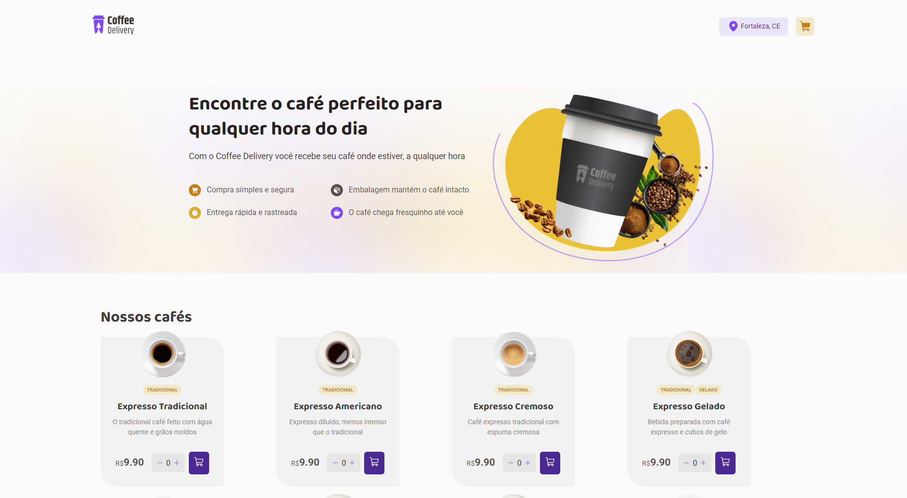

# Coffee Delivery

<div>
  
  
  
</div>


 
Uma página web que gerencia um carrinho de compras de uma cafeteria fictícia, que contém as seguintes funcionalidades:
- Listagem de produtos (cafés) disponíveis para compra
- Adicionar uma quantidade específicas de itens no carrinho
- Aumentar ou remover a quantidade de itens no carrinho
- Formulário para o usuário preencher o seu endereço
- Exibir o total de itens no carrinho no Header
- Exibir o valor total da soma de itens no carrinho multiplicados pelo valor

## Dependências e Versões Utilizadas
- React: ^18.2.0
- Typescript: ^5.2.2
- Vite: ^5.2.0
- Styled-components: ^6.1.11
<div>
  
  @phosphor-icons/react: ^2.1.5
</div>

## Como rodar o projeto ✅

Primeiro você vai clonar esse repositório para sua máquina local
```
git clone https://github.com/helzaaragao/CoffeeDelivery.git
```

Depois, vá até a pasta que você acabou de criar com o git clone:

```
cd "CoffeeDelivery"
```
E instale todas as depedências e versões certas:

```
npm install
```
Finalmente, rode no seu localhost:
```
npm run dev
```

Precisa ter o node, vscode ou um terminal para executar os comandos


```
npm run dev
```
